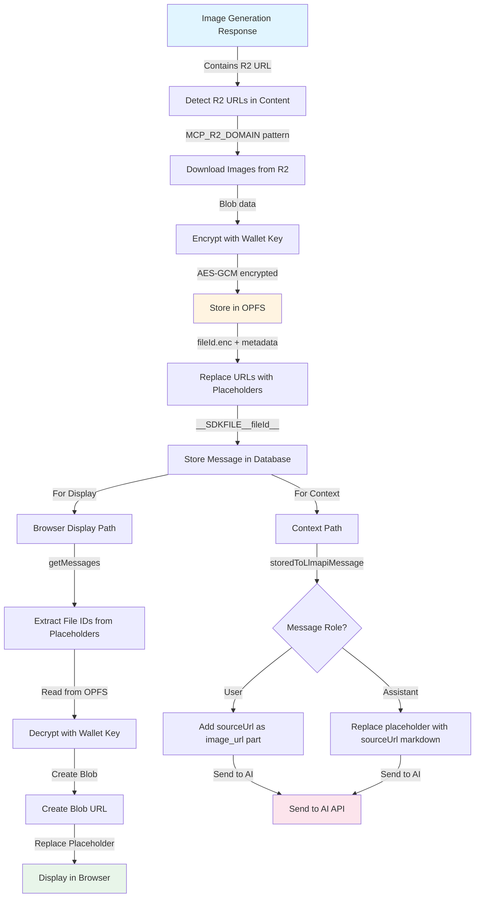

# Image Generation R2 Bucket URL Download and Encryption Flow

## Introduction

When images are generated through the AI SDK, they are returned as URLs pointing to an R2 bucket (Cloudflare's object storage). To ensure secure, local storage and prevent dependency on external URLs that may expire, the SDK automatically:

1. Detects R2 bucket URLs in generated image responses
2. Downloads the images from R2
3. Encrypts them using wallet-derived encryption keys
4. Stores them locally in the browser's Origin Private File System (OPFS)
5. Replaces the R2 URLs with internal placeholders in stored messages
6. Resolves placeholders to blob URLs for browser display
7. Replaces placeholders with original sourceUrls when sending messages as context to the AI

This flow ensures that images remain accessible even if the R2 URLs expire, while maintaining security through encryption and privacy by keeping images local to the user's browser.

## Flow Diagram



## URL Detection and Download

When an assistant message containing image generation results is received, the SDK scans the content for R2 bucket URLs using a regex pattern that matches the MCP R2 domain.

### URL Pattern Detection

The detection uses a regex pattern that matches URLs from the MCP R2 domain:

```1236:1239:src/react/useChatStorage.ts
        const MCP_IMAGE_URL_PATTERN = new RegExp(
          `https://${MCP_R2_DOMAIN.replace(/\./g, "\\.")}[^\\s"'<>)]*`,
          "g"
        );
```

The pattern stops at quotes, angle brackets, whitespace, or closing parentheses to properly handle HTML attributes and markdown syntax.

### Download Process

Once URLs are detected, they are downloaded in parallel with a 30-second timeout:

```1296:1328:src/react/useChatStorage.ts
        // Process all images in parallel
        const results = await Promise.allSettled(
          uniqueUrls.map(async (imageUrl) => {
            const controller = new AbortController();
            const timeoutId = setTimeout(() => controller.abort(), 30000);

            try {
              const response = await fetch(imageUrl, {
                signal: controller.signal,
                cache: "no-store",
              });

              if (!response.ok) {
                throw new Error(`Failed to fetch image: ${response.status}`);
              }

              const blob = await response.blob();
              const fileId = crypto.randomUUID();
              const urlPath = imageUrl.split("?")[0] ?? imageUrl;
              const extension = urlPath.match(/\.([a-zA-Z0-9]+)$/)?.[1] || "png";
              const mimeType = blob.type || `image/${extension}`;
              const fileName = `mcp-image-${Date.now()}-${fileId.slice(0, 8)}.${extension}`;

              // Encrypt and store in OPFS
              await writeEncryptedFile(fileId, blob, encryptionKey, {
                name: fileName,
                sourceUrl: imageUrl,
              });

              return { fileId, fileName, mimeType, size: blob.size, imageUrl };
            } finally {
              clearTimeout(timeoutId);
            }
          })
        );
```

## Encryption and Storage

### Encryption Process

Images are encrypted using AES-GCM encryption with a wallet-derived encryption key. The encryption process:

1. Generates a random 12-byte initialization vector (IV)
2. Encrypts the image blob using AES-GCM
3. Combines IV + ciphertext into a single buffer
4. Converts to hex string for storage

```76:99:src/lib/storage/opfs.ts
async function encryptBlob(
  blob: Blob,
  encryptionKey: CryptoKey
): Promise<string> {
  const arrayBuffer = await blob.arrayBuffer();
  const plaintext = new Uint8Array(arrayBuffer);

  // Generate random 12-byte IV
  const iv = crypto.getRandomValues(new Uint8Array(12));

  // Encrypt
  const ciphertext = await crypto.subtle.encrypt(
    { name: "AES-GCM", iv },
    encryptionKey,
    plaintext
  );

  // Combine IV + ciphertext
  const combined = new Uint8Array(iv.length + ciphertext.byteLength);
  combined.set(iv, 0);
  combined.set(new Uint8Array(ciphertext), iv.length);

  return bytesToHex(combined);
}
```

### OPFS Storage

Encrypted files are stored in the browser's Origin Private File System (OPFS) with two files per image:

1. **Encrypted content file** (`{fileId}.enc`): Contains the hex-encoded IV + ciphertext
2. **Metadata file** (`{fileId}.meta.json`): Contains unencrypted metadata (id, name, type, size, sourceUrl, createdAt)

```148:187:src/lib/storage/opfs.ts
export async function writeEncryptedFile(
  fileId: string,
  blob: Blob,
  encryptionKey: CryptoKey,
  metadata?: { name?: string; sourceUrl?: string }
): Promise<void> {
  if (!isOPFSSupported()) {
    throw new Error("OPFS is not supported in this browser");
  }

  const dir = await getSDKDirectory();

  // Encrypt the blob
  const encryptedHex = await encryptBlob(blob, encryptionKey);

  // Store encrypted content
  const contentHandle = await dir.getFileHandle(`${fileId}.enc`, {
    create: true,
  });
  const contentWritable = await contentHandle.createWritable();
  await contentWritable.write(encryptedHex);
  await contentWritable.close();

  // Store metadata (unencrypted - just IDs and types, no sensitive data)
  const fileMetadata: StoredFileMetadata = {
    id: fileId,
    name: metadata?.name || `file-${fileId}`,
    type: blob.type || "application/octet-stream",
    size: blob.size,
    sourceUrl: metadata?.sourceUrl,
    createdAt: Date.now(),
  };

  const metaHandle = await dir.getFileHandle(`${fileId}.meta.json`, {
    create: true,
  });
  const metaWritable = await metaHandle.createWritable();
  await metaWritable.write(JSON.stringify(fileMetadata));
  await metaWritable.close();
}
```

## URL Replacement with Placeholders

After downloading and storing images, the original R2 URLs in the message content are replaced with internal placeholders. The placeholder format is `__SDKFILE__{fileId}__`, which is designed to never be interpreted as markdown or HTML.

### Replacement Patterns

The replacement handles multiple URL formats:

1. **HTML img tags** (double-quoted src): ``
2. **HTML img tags** (single-quoted src): ``
3. **Markdown images**: ``
4. **Raw URLs**: `https://...r2.../image.png`

```1345:1434:src/react/useChatStorage.ts
            // Create internal placeholder (never shown to clients)
            const placeholder = createFilePlaceholder(fileId);
            const escapedUrl = imageUrl.replace(/[.*+?^${}()|[\]\\]/g, "\\$&");
            let replacementCount = 0;

            // eslint-disable-next-line no-console
            console.log(
              `[extractAndStoreEncryptedMCPImages] Replacing URL with placeholder:`,
              imageUrl,
              "->",
              placeholder
            );

            // Replace HTML img tags with double-quoted src
            const htmlImgPatternDouble = new RegExp(
              `]*src="${escapedUrl}"[^>]*>`,
              "gi"
            );
            const doubleMatches = cleanedContent.match(htmlImgPatternDouble);
            if (doubleMatches) {
              // eslint-disable-next-line no-console
              console.log(
                `[extractAndStoreEncryptedMCPImages] Replacing ${doubleMatches.length} HTML img tag(s) with double quotes:`,
                doubleMatches,
                "->",
                placeholder
              );
              replacementCount += doubleMatches.length;
              cleanedContent = cleanedContent.replace(
                htmlImgPatternDouble,
                placeholder
              );
            }

            // Replace HTML img tags with single-quoted src
            const htmlImgPatternSingle = new RegExp(
              `]*src='${escapedUrl}'[^>]*>`,
              "gi"
            );
            const singleMatches = cleanedContent.match(htmlImgPatternSingle);
            if (singleMatches) {
              // eslint-disable-next-line no-console
              console.log(
                `[extractAndStoreEncryptedMCPImages] Replacing ${singleMatches.length} HTML img tag(s) with single quotes:`,
                singleMatches,
                "->",
                placeholder
              );
              replacementCount += singleMatches.length;
              cleanedContent = cleanedContent.replace(
                htmlImgPatternSingle,
                placeholder
              );
            }

            // Replace markdown image syntax
            const markdownImagePattern = new RegExp(
              `!\\[[^\\]]*\\]\\([\\s]*${escapedUrl}[\\s]*\\)`,
              "g"
            );
            const markdownMatches = cleanedContent.match(markdownImagePattern);
            if (markdownMatches) {
              // eslint-disable-next-line no-console
              console.log(
                `[extractAndStoreEncryptedMCPImages] Replacing ${markdownMatches.length} markdown image(s):`,
                markdownMatches,
                "->",
                placeholder
              );
              replacementCount += markdownMatches.length;
              cleanedContent = cleanedContent.replace(
                markdownImagePattern,
                placeholder
              );
            }

            // Replace raw URLs (only if not already replaced)
            const rawUrlPattern = new RegExp(escapedUrl, "g");
            const rawMatches = cleanedContent.match(rawUrlPattern);
            if (rawMatches) {
              // eslint-disable-next-line no-console
              console.log(
                `[extractAndStoreEncryptedMCPImages] Replacing ${rawMatches.length} raw URL(s):`,
                rawMatches,
                "->",
                placeholder
              );
              replacementCount += rawMatches.length;
              cleanedContent = cleanedContent.replace(rawUrlPattern, placeholder);
            }
```

The message is then stored in the database with placeholders instead of R2 URLs, along with file metadata that includes the `sourceUrl` for later reference.

## Browser Display Replacement

When messages are retrieved for display in the browser, placeholders must be resolved to blob URLs so images can be rendered. This happens in the `getMessages` function.

### Placeholder Resolution

The resolution process:

1. Extracts file IDs from placeholders in the message content
2. Checks if a blob URL already exists for each file ID (cached)
3. If not cached, reads and decrypts the file from OPFS
4. Creates a blob URL from the decrypted blob
5. Replaces the placeholder with markdown image syntax using the blob URL

```616:700:src/react/useChatStorage.ts
          const resolvedMessages = await Promise.all(
            messages.map(async (msg) => {
              const fileIds = extractFileIds(msg.content);

              if (fileIds.length === 0) {
                return msg;
              }

              // Resolve each file to a blob URL
              let resolvedContent = msg.content;
              for (const fileId of fileIds) {
                const placeholder = createFilePlaceholder(fileId);
                // eslint-disable-next-line no-console
                console.log(
                  `[getMessages] Resolving placeholder: ${placeholder} (fileId: ${fileId})`
                );

                // Check if we already have a URL for this file
                let url = blobManager.getUrl(fileId);

                if (!url) {
                  // eslint-disable-next-line no-console
                  console.log(
                    `[getMessages] No cached URL for ${fileId}, reading from OPFS...`
                  );
                  // Read and decrypt the file
                  const result = await readEncryptedFile(fileId, encryptionKey);
                  if (result) {
                    url = blobManager.createUrl(fileId, result.blob);
                    // eslint-disable-next-line no-console
                    console.log(
                      `[getMessages] Created blob URL for ${fileId}:`,
                      url
                    );
                  } else {
                    // eslint-disable-next-line no-console
                    console.warn(
                      `[getMessages] Failed to read file ${fileId} from OPFS`
                    );
                  }
                } else {
                  // eslint-disable-next-line no-console
                  console.log(
                    `[getMessages] Using cached blob URL for ${fileId}:`,
                    url
                  );
                }

                if (url) {
                  const placeholderRegex = new RegExp(
                    placeholder.replace(/[.*+?^${}()|[\]\\]/g, "\\$&"),
                    "g"
                  );
                  resolvedContent = resolvedContent.replace(
                    placeholderRegex,
                    ``
                  );
                }
              }

              return {
                ...msg,
                content: resolvedContent,
              };
            })
          );
```

### Blob URL Management

The `BlobUrlManager` class tracks active blob URLs to prevent memory leaks:

```275:324:src/lib/storage/opfs.ts
export class BlobUrlManager {
  private activeUrls = new Map<string, string>(); // fileId -> blobUrl

  /**
   * Creates a blob URL for a file and tracks it.
   */
  createUrl(fileId: string, blob: Blob): string {
    // Revoke existing URL if any
    this.revokeUrl(fileId);

    const url = URL.createObjectURL(blob);
    this.activeUrls.set(fileId, url);
    return url;
  }

  /**
   * Gets the active blob URL for a file, if any.
   */
  getUrl(fileId: string): string | undefined {
    return this.activeUrls.get(fileId);
  }

  /**
   * Revokes a blob URL and removes it from tracking.
   */
  revokeUrl(fileId: string): void {
    const url = this.activeUrls.get(fileId);
    if (url) {
      URL.revokeObjectURL(url);
      this.activeUrls.delete(fileId);
    }
  }

  /**
   * Revokes all tracked blob URLs.
   */
  revokeAll(): void {
    for (const url of this.activeUrls.values()) {
      URL.revokeObjectURL(url);
    }
    this.activeUrls.clear();
  }

  /**
   * Gets the count of active blob URLs.
   */
  get size(): number {
    return this.activeUrls.size;
  }
}
```

## Context Replacement for Follow-up Messages

When messages are sent as context to the AI in follow-up conversations, placeholders must be replaced with the original `sourceUrl` so the AI can access the images. This happens in the `storedToLlmapiMessage` function.

### Message Role Handling

The replacement logic differs based on message role:

#### User Messages

For user messages, images are added as separate `image_url` content parts:

```189:207:src/react/useChatStorage.ts
  if (stored.role !== "assistant" && stored.files?.length) {
    for (const file of stored.files) {
      // First check if there's a direct url (user uploads with data URIs)
      if (file.url) {
        imageParts.push({
          type: "image_url",
          image_url: { url: file.url },
        });
      } else if (file.sourceUrl) {
        // For MCP-cached files, include the sourceUrl
        // If expired, AI simply won't see the image (local OPFS copy is for display only)
        imageParts.push({
          type: "image_url",
          image_url: { url: file.sourceUrl },
        });
        // Track sourceUrl for placeholder replacement
        fileUrlMap.set(file.id, file.sourceUrl);
      }
    }
  }
```

#### Assistant Messages

For assistant messages, placeholders in the text content are replaced with markdown image syntax pointing to the `sourceUrl`:

```208:216:src/react/useChatStorage.ts
  } else if (stored.role === "assistant" && stored.files?.length) {
    // For assistant messages, track sourceUrls for placeholder replacement only
    // URLs are already in text as markdown images, so model can get them from context
    for (const file of stored.files) {
      if (file.sourceUrl) {
        fileUrlMap.set(file.id, file.sourceUrl);
      }
    }
  }
```

### Placeholder Replacement

Placeholders are then replaced with markdown image syntax using the `sourceUrl`:

```218:243:src/react/useChatStorage.ts
  // Replace internal __SDKFILE__ placeholders with sourceUrls or remove them
  textContent = textContent.replace(
    /__SDKFILE__([a-f0-9-]+)__/g,
    (match, fileId) => {
      const sourceUrl = fileUrlMap.get(fileId);
      if (sourceUrl) {
        // Replace with markdown image pointing to sourceUrl
        return ``;
      }
      // Remove placeholder if no URL available
      return "";
    }
  );

  // Also handle legacy ![MCP_IMAGE:fileId] placeholders for backward compatibility
  // This supports old messages that may still contain MCP_IMAGE placeholders
  textContent = textContent.replace(
    /!\[MCP_IMAGE:([a-f0-9-]+)\]/g,
    (match, fileId) => {
      const sourceUrl = fileUrlMap.get(fileId);
      if (sourceUrl) {
        return ``;
      }
      return "";
    }
  );
```

**Important Note**: If the R2 URL has expired, the AI won't be able to access the image. The local OPFS copy is for display purposes only and is not sent to the AI. This is by design - expired URLs mean the image is no longer available from the source, and the AI should work with the text context instead.

## Key Components

### Main Functions

- **`extractAndStoreEncryptedMCPImages`** ([src/react/useChatStorage.ts:1206](src/react/useChatStorage.ts)): Detects R2 URLs, downloads, encrypts, and stores images, replacing URLs with placeholders
- **`writeEncryptedFile`** ([src/lib/storage/opfs.ts:148](src/lib/storage/opfs.ts)): Encrypts and stores files in OPFS
- **`readEncryptedFile`** ([src/lib/storage/opfs.ts:196](src/lib/storage/opfs.ts)): Reads and decrypts files from OPFS
- **`resolveFilePlaceholders`** ([src/lib/storage/opfs.ts:334](src/lib/storage/opfs.ts)): Resolves placeholders to blob URLs for display
- **`storedToLlmapiMessage`** ([src/react/useChatStorage.ts:180](src/react/useChatStorage.ts)): Converts stored messages to API format, replacing placeholders with sourceUrls for context

### Key Types

- **`FileMetadata`** ([src/lib/db/chat/types.ts:23](src/lib/db/chat/types.ts)): Defines the structure of file metadata, including the distinction between `url` (for user uploads) and `sourceUrl` (for cached files)
- **`BlobUrlManager`** ([src/lib/storage/opfs.ts:275](src/lib/storage/opfs.ts)): Manages blob URL lifecycle to prevent memory leaks

### Constants

- **`MCP_R2_DOMAIN`** ([src/clientConfig.ts:5](src/clientConfig.ts)): The R2 bucket domain used for image generation URLs
- **`FILE_PLACEHOLDER_PREFIX`** and **`FILE_PLACEHOLDER_SUFFIX`** ([src/lib/storage/opfs.ts:10-11](src/lib/storage/opfs.ts)): Define the placeholder format

## Summary

The image generation R2 flow provides a secure, local-first approach to handling generated images:

1. **Security**: Images are encrypted with wallet-derived keys before storage
2. **Privacy**: Images remain in the user's browser (OPFS), never sent to external servers
3. **Reliability**: Images remain accessible even if R2 URLs expire
4. **Performance**: Blob URLs are cached to avoid repeated decryption
5. **Context Preservation**: Original sourceUrls are preserved for AI context, allowing the AI to access images when URLs are still valid

The dual-path approach (blob URLs for display, sourceUrls for context) ensures optimal user experience while maintaining compatibility with AI APIs that expect accessible image URLs.

