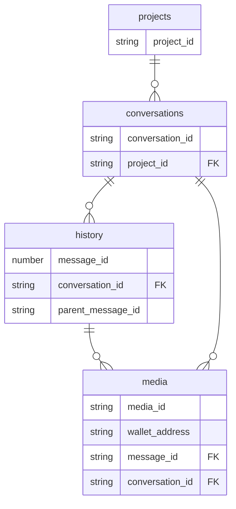

# Database Schema

Current version: **v16**

## Tables

- [history](#history)
- [conversations](#conversations)
- [projects](#projects)
- [modelPreferences](#modelpreferences)
- [userPreferences](#userpreferences)
- [memory vault](#memory-vault)
- [media](#media)

## history

| Column | Type | Indexed | Optional |
|--------|------|---------|----------|
| `message_id` | number |  |  |
| `conversation_id` | string | ✓ |  |
| `role` | string | ✓ |  |
| `content` | string |  |  |
| `model` | string |  | ✓ |
| `files` | string |  | ✓ |
| `file_ids` | string |  | ✓ |
| `created_at` | number | ✓ |  |
| `updated_at` | number |  |  |
| `vector` | string |  | ✓ |
| `embedding_model` | string |  | ✓ |
| `chunks` | string |  | ✓ |
| `usage` | string |  | ✓ |
| `sources` | string |  | ✓ |
| `response_duration` | number |  | ✓ |
| `was_stopped` | boolean |  | ✓ |
| `error` | string |  | ✓ |
| `thought_process` | string |  | ✓ |
| `thinking` | string |  | ✓ |
| `parent_message_id` | string |  | ✓ |
| `feedback` | string |  | ✓ |

## conversations

| Column | Type | Indexed | Optional |
|--------|------|---------|----------|
| `conversation_id` | string | ✓ |  |
| `title` | string |  |  |
| `project_id` | string | ✓ | ✓ |
| `created_at` | number |  |  |
| `updated_at` | number |  |  |
| `is_deleted` | boolean | ✓ |  |

## projects

| Column | Type | Indexed | Optional |
|--------|------|---------|----------|
| `project_id` | string | ✓ |  |
| `name` | string |  |  |
| `created_at` | number |  |  |
| `updated_at` | number |  |  |
| `is_deleted` | boolean | ✓ |  |

## modelPreferences

| Column | Type | Indexed | Optional |
|--------|------|---------|----------|
| `wallet_address` | string | ✓ |  |
| `models` | string |  | ✓ |

## userPreferences

| Column | Type | Indexed | Optional |
|--------|------|---------|----------|
| `wallet_address` | string | ✓ |  |
| `nickname` | string |  | ✓ |
| `occupation` | string |  | ✓ |
| `description` | string |  | ✓ |
| `models` | string |  | ✓ |
| `personality` | string |  | ✓ |
| `created_at` | number |  |  |
| `updated_at` | number |  |  |

## memory vault

| Column | Type | Indexed | Optional |
|--------|------|---------|----------|
| `content` | string |  |  |
| `scope` | string | ✓ |  |
| `created_at` | number | ✓ |  |
| `updated_at` | number |  |  |
| `is_deleted` | boolean | ✓ |  |

## media

| Column | Type | Indexed | Optional |
|--------|------|---------|----------|
| `media_id` | string | ✓ |  |
| `wallet_address` | string | ✓ |  |
| `message_id` | string | ✓ | ✓ |
| `conversation_id` | string | ✓ | ✓ |
| `name` | string |  |  |
| `mime_type` | string | ✓ |  |
| `media_type` | string | ✓ |  |
| `size` | number |  |  |
| `role` | string | ✓ |  |
| `model` | string | ✓ | ✓ |
| `source_url` | string |  | ✓ |
| `dimensions` | string |  | ✓ |
| `duration` | number |  | ✓ |
| `metadata` | string |  | ✓ |
| `created_at` | number | ✓ |  |
| `updated_at` | number |  |  |
| `is_deleted` | boolean | ✓ |  |

## Migration History

| Version | Changes |
|---------|---------|
| v16 | Added `scope` to `memory_vault`; `UPDATE memory_vault SET scope = 'private' WHERE scope IS NULL OR scope = '';` |
| v15 | `DROP TABLE IF EXISTS memories;`; Added `memory_vault` table |
| v14 | Added `feedback` to `history` |
| v13 | Added `parent_message_id` to `history` |
| v12 | Added `chunks` to `history` |
| v11 | Added `media` table; Added `file_ids` to `history` |
| v10 | Added `projects` table; Added `project_id` to `conversations` |
| v9 | Added `thinking` to `history` |
| v8 | `DELETE FROM history;`; `DELETE FROM conversations;`; `DELETE FROM memories;` |
| v7 | Added `userPreferences` table |
| v6 | Added `thought_process` to `history` |
| v5 | Added `error` to `history` |
| v4 | Added `modelPreferences` table |
| v3 | Added `was_stopped` to `history` |
| v2 | Baseline — `history`, `conversations`, and `memories` tables |
