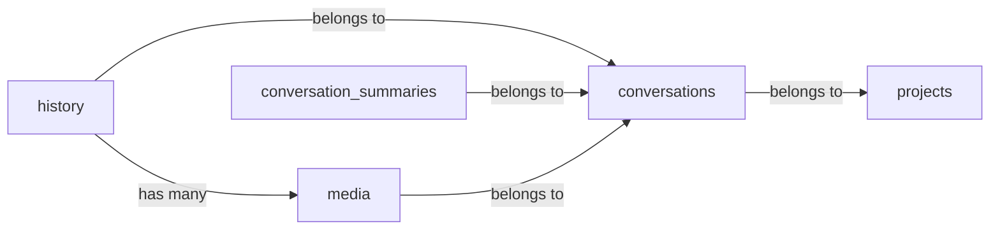

# Database Schema

Current version: **v37**

## Tables

- [history](#history)
- [conversations](#conversations)
- [projects](#projects)
- [modelPreferences](#modelPreferences)
- [userPreferences](#userPreferences)
- [memory_vault](#memory_vault)
- [entity](#entity)
- [memory_entity](#memory_entity)
- [vault_folders](#vault_folders)
- [conversation_summaries](#conversation_summaries)
- [media](#media)
- [app_files](#app_files)
- [saved_tools](#saved_tools)
- [conversation_memory](#conversation_memory)

## history

| Column | Type | Indexed | Optional |
|--------|------|---------|----------|
| `message_id` | number |  |  |
| `conversation_id` | string | ✓ |  |
| `role` | string | ✓ |  |
| `content` | string |  |  |
| `model` | string |  | ✓ |
| `image_model` | string |  | ✓ |
| `files` | string |  | ✓ |
| `file_ids` | string |  | ✓ |
| `created_at` | number | ✓ |  |
| `updated_at` | number |  |  |
| `vector` | string |  | ✓ |
| `embedding_model` | string |  | ✓ |
| `chunks` | string |  | ✓ |
| `usage` | string |  | ✓ |
| `sources` | string |  | ✓ |
| `response_duration` | number |  | ✓ |
| `was_stopped` | boolean |  | ✓ |
| `error` | string |  | ✓ |
| `thought_process` | string |  | ✓ |
| `thinking` | string |  | ✓ |
| `parent_message_id` | string |  | ✓ |
| `feedback` | string |  | ✓ |
| `tool_call_events` | string |  | ✓ |

## conversations

| Column | Type | Indexed | Optional |
|--------|------|---------|----------|
| `conversation_id` | string | ✓ |  |
| `title` | string |  |  |
| `project_id` | string | ✓ | ✓ |
| `created_at` | number |  |  |
| `updated_at` | number |  |  |
| `is_deleted` | boolean | ✓ |  |
| `pinned_at` | number |  | ✓ |

## projects

| Column | Type | Indexed | Optional |
|--------|------|---------|----------|
| `project_id` | string | ✓ |  |
| `name` | string |  |  |
| `created_at` | number |  |  |
| `updated_at` | number |  |  |
| `is_deleted` | boolean | ✓ |  |

## modelPreferences

| Column | Type | Indexed | Optional |
|--------|------|---------|----------|
| `wallet_address` | string | ✓ |  |
| `models` | string |  | ✓ |

## userPreferences

| Column | Type | Indexed | Optional |
|--------|------|---------|----------|
| `wallet_address` | string | ✓ |  |
| `nickname` | string |  | ✓ |
| `occupation` | string |  | ✓ |
| `description` | string |  | ✓ |
| `models` | string |  | ✓ |
| `personality` | string |  | ✓ |
| `created_at` | number |  |  |
| `updated_at` | number |  |  |

## memory_vault

| Column | Type | Indexed | Optional |
|--------|------|---------|----------|
| `content` | string |  |  |
| `scope` | string | ✓ |  |
| `folder_id` | string | ✓ | ✓ |
| `created_at` | number | ✓ |  |
| `updated_at` | number | ✓ |  |
| `is_deleted` | boolean | ✓ |  |
| `user_id` | string | ✓ | ✓ |
| `embedding` | string |  | ✓ |
| `embedding_model` | string |  | ✓ |
| `source_chunk_ids` | string |  | ✓ |
| `proof_count` | number |  | ✓ |
| `source` | string |  | ✓ |
| `event_time_start` | number | ✓ | ✓ |
| `event_time_end` | number |  | ✓ |
| `event_time_kind` | string |  | ✓ |
| `topics_user_managed` | boolean |  | ✓ |
| `topics_extracted_at` | number |  | ✓ |
| `topics_extracted_version` | number |  | ✓ |

## entity

| Column | Type | Indexed | Optional |
|--------|------|---------|----------|
| `canonical_name` | string | ✓ |  |
| `kind` | string |  | ✓ |
| `created_at` | number |  |  |
| `updated_at` | number |  |  |

## memory_entity

| Column | Type | Indexed | Optional |
|--------|------|---------|----------|
| `memory_id` | string | ✓ |  |
| `entity_id` | string | ✓ |  |
| `user_id` | string | ✓ | ✓ |
| `created_at` | number |  |  |

## vault_folders

| Column | Type | Indexed | Optional |
|--------|------|---------|----------|
| `name` | string |  |  |
| `scope` | string |  |  |
| `created_at` | number | ✓ |  |
| `updated_at` | number |  |  |
| `is_deleted` | boolean | ✓ |  |
| `is_system` | boolean |  | ✓ |
| `context` | string |  | ✓ |

## conversation_summaries

| Column | Type | Indexed | Optional |
|--------|------|---------|----------|
| `conversation_id` | string | ✓ |  |
| `summary` | string |  |  |
| `summarized_up_to` | string |  |  |
| `token_count` | number |  |  |
| `created_at` | number |  |  |
| `updated_at` | number |  |  |

## media

| Column | Type | Indexed | Optional |
|--------|------|---------|----------|
| `media_id` | string | ✓ |  |
| `wallet_address` | string | ✓ |  |
| `message_id` | string | ✓ | ✓ |
| `conversation_id` | string | ✓ | ✓ |
| `name` | string |  |  |
| `mime_type` | string | ✓ |  |
| `media_type` | string | ✓ |  |
| `size` | number |  |  |
| `role` | string | ✓ |  |
| `model` | string | ✓ | ✓ |
| `source_url` | string |  | ✓ |
| `dimensions` | string |  | ✓ |
| `duration` | number |  | ✓ |
| `metadata` | string |  | ✓ |
| `created_at` | number | ✓ |  |
| `updated_at` | number |  |  |
| `is_deleted` | boolean | ✓ |  |

## app_files

| Column | Type | Indexed | Optional |
|--------|------|---------|----------|
| `conversation_id` | string | ✓ |  |
| `path` | string |  |  |
| `content` | string |  |  |
| `created_at` | number | ✓ |  |
| `updated_at` | number |  |  |

## saved_tools

| Column | Type | Indexed | Optional |
|--------|------|---------|----------|
| `name` | string |  |  |
| `display_name` | string |  |  |
| `description` | string |  |  |
| `parameters` | string |  |  |
| `html` | string |  |  |
| `conversation_id` | string |  | ✓ |
| `created_at` | number | ✓ |  |
| `updated_at` | number |  |  |
| `is_deleted` | boolean | ✓ |  |

## conversation_memory

| Column | Type | Indexed | Optional |
|--------|------|---------|----------|
| `conversation_id` | string | ✓ |  |
| `memory_id` | string | ✓ |  |
| `score` | number |  |  |
| `created_at` | number | ✓ |  |

## Migration History

| Version | Changes |
|---------|---------|
| v37 | Added `topics_extracted_version` to `memory_vault` |
| v36 | Added `topics_extracted_at` to `memory_vault` |
| v35 | Added `conversation_memory` table |
| v34 | Added `topics_user_managed` to `memory_vault` |
| v33 | Added `embedding_model` to `memory_vault` |
| v32 | Added `pinned_at` to `conversations` |
| v31 | Added `user_id` to `memory_entity`; `UPDATE memory_entity SET user_id = (SELECT user_id FROM memory_vault WHERE memory_vault.id = memory_entity.memory_id) WHERE user_id IS NULL;` |
| v30 | Added `event_time_start`, `event_time_end`, `event_time_kind` to `memory_vault` |
| v29 | Added `entity` table; Added `memory_entity` table |
| v28 | Added `source_chunk_ids`, `proof_count`, `source` to `memory_vault` |
| v27 | Added `tool_call_events` to `history` |
| v26 | Added `app_files` table |
| v25 | Added `saved_tools` table |
| v24 | Added `context` to `vault_folders` |
| v23 | Added `conversation_summaries` table |
| v22 | Added `is_system` to `vault_folders` |
| v21 | Added `embedding` to `memory_vault` |
| v20 | `CREATE INDEX IF NOT EXISTS memory_vault_updated_at ON memory_vault (updated_at);` |
| v19 | Added `user_id` to `memory_vault` |
| v18 | Added `vault_folders` table; Added `folder_id` to `memory_vault` |
| v17 | Added `image_model` to `history` |
| v16 | Added `scope` to `memory_vault`; `UPDATE memory_vault SET scope = 'private' WHERE scope IS NULL OR scope = '';` |
| v15 | `DROP TABLE IF EXISTS memories;`; Added `memory_vault` table |
| v14 | Added `feedback` to `history` |
| v13 | Added `parent_message_id` to `history` |
| v12 | Added `chunks` to `history` |
| v11 | Added `media` table; Added `file_ids` to `history` |
| v10 | Added `projects` table; Added `project_id` to `conversations` |
| v9 | Added `thinking` to `history` |
| v8 | `DELETE FROM history;`; `DELETE FROM conversations;`; `DELETE FROM memories;` |
| v7 | Added `userPreferences` table |
| v6 | Added `thought_process` to `history` |
| v5 | Added `error` to `history` |
| v4 | Added `modelPreferences` table |
| v3 | Added `was_stopped` to `history` |
| v2 | Baseline — `history`, `conversations`, and `memories` tables |
